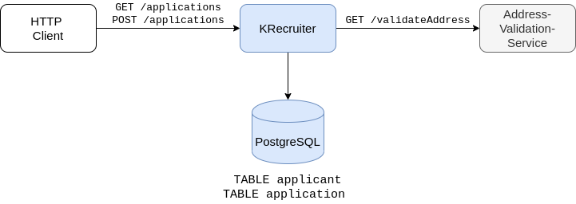

# KRecruiter

Example application to improve your testing skills with Kotlin. 

# Setup

We like to have a setup that is as practical as possible. A real setup includes databases and remote services. That's why we have to install some tools (like Docker) to simplify the handling those external dependencies for local development and testing.  

## Requirements

Please install the following software on your machine:

- [Docker](https://docs.docker.com/install/)
- [Docker-Compose](https://docs.docker.com/compose/install/)
- Java 11 (e.g. via [SDKMan](https://sdkman.io/))
- IntelliJ IDEA
- Latest IntelliJ IDEA Plugins (File > Settings > Plugins > Marketplace)
    - "Kotlin"
    - "Kotest"

## Checkout, Build, Run

Let's set up this project.

Checkout:

```bash
git clone https://github.com/phauer/krecruiter.git
cd krecruiter
```

Start a PostgreSQL, adminer, and the stub for the address-validation-service:

```bash
docker-compose up
```

In order to run the application you have two options:

- Open Project in IntelliJ (`File` > `Open...`) and start the `KRecruiterApplication.kt` via right click > "Run KRecruiterApplication.kt..."
- Run `./mvnw spring-boot:run` (Mac, Linux) or `./mvnw.cmd spring-boot:run` (Windows)

Test the application by opening [http://localhost:8080/applications](http://localhost:8080/applications) in your browser or by calling:

```bash
curl localhost:8080/applications
```

You should see a payload like this:

```json
[
  {
    "id": 11600000,
    "fullName": "Rolf Goldner",
    "jobTitle": "International Engineer",
    "state": "EMPLOYED",
    "dateCreated": 1254806649.781000000,
    "attachments": {
       "Quasi laborum natus.": "eligendi_quis/accusantium.gif",
       "Ea maxime.": "dolor_ad/voluptatem.csv"     
    }
  },
  {
    ... 
  }
]
```

## Optional

- HTTP Client [httpie](https://httpie.org/) or [Postman](https://www.getpostman.com/) to try the HTTP API 
- You can download the sources (and javadoc) of all libraries up front using `./mvnw dependency:sources`. This eases code navigation in IntelliJ. 

## Inspect the PostgreSQL

You can use your favorite SQL Client or the [adminer](https://www.adminer.org/) - a simple Web UI that is already started via docker-compose. Open [http://localhost:900/?pgsql=db&username=user&db=krecruiter&ns=public](http://localhost:900/?pgsql=db&username=user&db=krecruiter&ns=public) in the browser. Use `password` for the password. You can also look up the database configuration in the `docker-compose.yml`.

# Big Picture

The application uses a database and calls a remote service in order to be as close to the testing reality as possible.  



# Trying the API

## GET `/applications`

```
~ ❯❯❯ http localhost:8080/applications
HTTP/1.1 200 
Content-Type: application/json
Date: Thu, 17 Oct 2019 18:19:04 GMT
Transfer-Encoding: chunked

[
    {
        "dateCreated": 1226431079.725,
        "fullName": "Mose Hintz",
        "id": 315,
        "jobTitle": "Future Construction Coordinator",
        "state": "RECEIVED"
    },
    ...
]
```

## POST `/applications`

```
~ ❯❯❯ http POST localhost:8080/applications firstName="Peter" lastName="Meier" street="Main Street 2" city="Cologne" jobTitle="Software Engineer" -v
POST /applications HTTP/1.1
Accept: application/json, */*
Accept-Encoding: gzip, deflate
Connection: keep-alive
Content-Length: 122
Content-Type: application/json
Host: localhost:8080
User-Agent: HTTPie/1.0.3

{
    "city": "Cologne",
    "firstName": "Peter",
    "jobTitle": "Software Engineer",
    "lastName": "Meier",
    "street": "Main Street 2"
}

HTTP/1.1 201 
Content-Length: 0
Date: Wed, 20 Nov 2019 11:58:32 GMT
Location: /applications/3


```

# Tasks 

- The tasks can be found [here](tasks.md). 
- **Please mind, that the `master` branch contains the solutions with all tests.** So please don't look at them if you don't want to be spoiled. :-) Instead check out the branches that are named in the [tasks.md](tasks.md) and start working from there.
